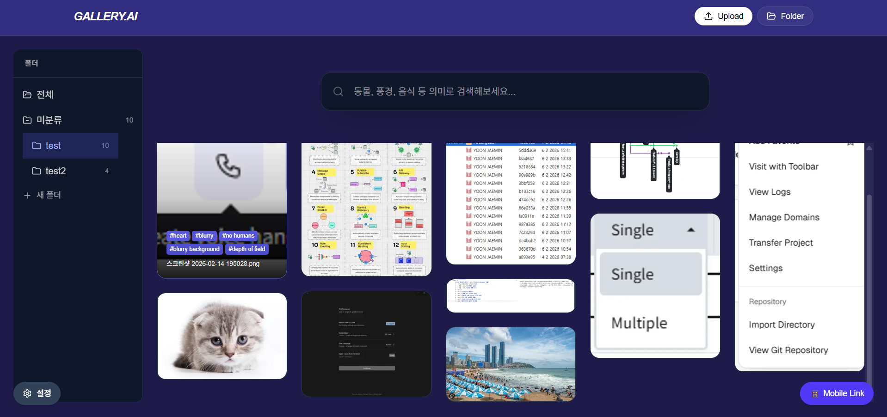

# AI Semantic Tag Gallery

이미지 업로드 시 AI가 자동으로 태그를 생성하고, **태그 기반 시맨틱 검색**과 **이미지 유사도 검색**을 지원하는 로컬 전용 지능형 갤러리입니다.  
**모든 AI 연산은 사용자 PC에서만 수행되며, 이미지는 외부 서버로 전송되지 않습니다.**

---

## 목차

- [주요 기능](#주요-기능)
- [기술 스택](#기술-스택)
- [사용된 AI 모델](#사용된-ai-모델)
- [데이터 저장 방식](#데이터-저장-방식)
- [시작하기](#시작하기)
- [실행 방법](#실행-방법)
- [사용 방법](#사용-방법)
- [휴대폰에서 접속 (Cloudflare 터널 + QR 코드)](#휴대폰에서-접속-cloudflare-터널--qr-코드)
- [설정](#설정)
- [유지보수·백필](#유지보수백필)
- [스크립트](#스크립트)
- [문제 해결](#문제-해결)

---

## 주요 기능

### 1. 자동 이미지 태깅 (WD14)

- 업로드한 이미지에 대해 **wd-eva02-large-tagger-v3** 모델로 수십 개의 관련 태그를 자동 추출합니다.
- 태그 민감도(임계값)를 설정에서 조절할 수 있으며, 낮을수록 더 많은 태그가 붙습니다.
- 제외 태그 목록을 두어 특정 태그는 저장하지 않도록 할 수 있습니다.

### 2. 시맨틱 태그 검색

- **paraphrase-multilingual-MiniLM-L12-v2** 모델로 검색어와 태그 간 **의미적 유사도**를 계산합니다.
- 예: "동물" 검색 시 "강아지", "고양이" 등 유사 의미 태그가 붙은 이미지가 검색됩니다.
- 설정에서 시맨틱 유사도 임계값(0.5~0.95)을 조절할 수 있습니다.

### 3. 유사 이미지 검색 (이미지 벡터 검색)

- **CLIP ViT-B/32** 모델로 각 이미지를 512차원 벡터로 인코딩해 **LanceDB**에 저장합니다.
- 갤러리에서 이미지를 **우클릭 → 이미지 검색**을 선택하면, 해당 이미지와 **시각적으로 유사한 이미지**를 전체 갤러리에서 찾아 오른쪽 드로어에 표시합니다.
- L2 거리 기준으로 가장 가까운 N개(기본 20개)를 반환합니다.
- **새로 업로드한 이미지**는 자동으로 벡터가 계산됩니다. **기존에 올려둔 이미지**는 설정의 **유지보수 → 이미지 벡터 백필**에서 한 번에 벡터를 채울 수 있습니다.

### 4. 폴더

- 이미지를 폴더로 묶어 관리할 수 있습니다.
- 폴더 목록과 소속 이미지 ID는 `data/folders.json`에 저장됩니다.

### 5. 실시간 편집

- 이미지별로 **태그 수정**, **메모(notes)** 작성이 가능하며, 변경 사항은 LanceDB와 동기화됩니다.

### 6. 로컬 전용·프라이버시

- 이미지와 메타데이터는 사용자 환경에서만 처리됩니다. 외부 AI API나 클라우드 저장소를 사용하지 않습니다.

### 7. 휴대폰에서 접속 (Cloudflare 터널 + QR 코드)

- **Cloudflare Quick Tunnel**을 이용해 로컬 갤러리를 인터넷에서 접근 가능한 임시 URL로 열어 둡니다.
- Python 서버 실행 시 터널이 자동으로 뜨며, **cloudflared** 바이너리가 없으면 프로젝트 `bin/`에 자동 다운로드됩니다. (별도 Cloudflare 계정 불필요, Zero-Configuration)
- 갤러리 화면 우측 하단 **「Mobile Link」** 버튼을 누르면 **접속 URL**과 **QR 코드**가 팝업으로 표시됩니다.
- 휴대폰 카메라나 QR 리더로 코드를 스캔하면, 같은 갤러리를 휴대폰 브라우저에서 바로 열 수 있습니다. (같은 Wi‑Fi가 아니어도 됩니다.)

---

## 기술 스택

### Frontend

| 항목 | 기술 |
|------|------|
| Framework | Next.js 16 (App Router) |
| Styling | Tailwind CSS 4 |
| Icons | Lucide React |
| 가상 스크롤 | @tanstack/react-virtual |

### Backend (AI 서버)

| 항목 | 기술 |
|------|------|
| Framework | FastAPI |
| 서버 | Uvicorn |
| 벡터 DB | LanceDB |

### AI·추론

| 용도 | 모델/라이브러리 |
|------|------------------|
| 이미지 태깅 | WD-v3 ViT-Eva02-Large-Tagger (transformers, ONNX 등) |
| 텍스트 임베딩 (시맨틱 검색) | sentence-transformers (paraphrase-multilingual-MiniLM-L12-v2) |
| 이미지 임베딩 (유사 이미지 검색) | sentence-transformers (CLIP ViT-B/32) |
| 벡터 검색 | LanceDB (로컬 디스크) |

- PyTorch는 CPU/GPU 환경에 맞게 **별도 설치**합니다. (requirements.txt에는 포함되지 않음.)

---

## 사용된 AI 모델

1. **이미지 태깅**  
   [WD-v3 ViT-Eva02-Large-Tagger](https://huggingface.co/SmilingWolf/wd-v3-vit-eva02-large-tagger)  
   - 업로드된 이미지에서 애니메이션/일반 태그를 추출합니다.  
   - 태깅 요청 시에만 로드되며, 2분간 미사용 시 메모리에서 해제됩니다.

2. **텍스트 임베딩 (시맨틱 검색)**  
   [paraphrase-multilingual-MiniLM-L12-v2](https://huggingface.co/sentence-transformers/paraphrase-multilingual-MiniLM-L12-v2)  
   - 검색어와 태그를 벡터로 바꾸어 의미적 유사도를 계산합니다.  
   - 50개 이상 언어 지원.

3. **이미지 임베딩 (유사 이미지 검색)**  
   [clip-ViT-B-32](https://huggingface.co/sentence-transformers/clip-ViT-B-32)  
   - 이미지를 512차원 벡터로 인코딩합니다.  
   - 유사 이미지 검색 시 L2 거리로 가장 가까운 이미지를 찾는 데 사용됩니다.  
   - 약 600MB 수준이며, 노트북 CPU에서도 동작합니다.

---


## 데이터 저장 방식

- **이미지 메타데이터·벡터**: **LanceDB** (`data/gallery/`).  
  - 컬럼: id, filename, thumbnail, originalName, tags, width, height, notes, createdAt, **vector**(512차원).  
  - 스키마 상세: [docs/lancedb-schema.md](docs/lancedb-schema.md)
- **폴더**: `data/folders.json` (폴더 id, 이름, imageIds).
- **앱 설정**: `data/settings.json` (테마, WD14/시맨틱 임계값, excludeTags 등).
- **이미지 파일**: `public/uploads/`, `public/thumbnails/`.

---

## 시작하기

### 필요 환경

- **Node.js** 18 이상
- **Python** 3.10 이상
- **(선택)** NVIDIA GPU + CUDA — 태깅·임베딩 속도 향상용. CPU만으로도 동작합니다.

### 설치

1. **저장소 클론**

   ```bash
   git clone https://github.com/Podargos37/ai-tag-gallery.git
   cd ai-tag-gallery
   ```

2. **Node 의존성 설치**

   ```bash
   npm install
   ```

3. **Python 가상환경 및 의존성**

   ```bash
   python -m venv .venv
   # Windows
   .venv\Scripts\activate
   # macOS/Linux
   source .venv/bin/activate

   pip install -r requirements.txt
   ```

4. **PyTorch 설치 (환경에 맞게 하나만)**

   - **CPU**:  
     `pip install torch torchvision`
   - **GPU (CUDA 12.1)**:  
     `pip install torch torchvision --index-url https://download.pytorch.org/whl/cu121`  
   - 다른 CUDA 버전: [PyTorch 설치 페이지](https://pytorch.org/get-started/locally/) 참고.

---

## 실행 방법

### 한 번에 실행 (Windows)

- 루트의 **`run.bat`** 더블 클릭.  
  - Next.js(3000), Python FastAPI(8000)를 띄우고, 필요 시 의존성 설치를 시도합니다.

### 수동 실행

1. **Next.js** (터미널 1)

   ```bash
   npm run dev
   ```

2. **Python AI 서버** (터미널 2, `server` 디렉터리 또는 프로젝트 루트에서)

   ```bash
   cd server
   python main.py
   ```

   - 기본: `http://0.0.0.0:8000`  
   - Next는 `http://localhost:3000`에서 접속.

3. 브라우저에서 **http://localhost:3000** 접속.

---

## 사용 방법

- **업로드**: 이미지를 드래그 앤 드롭하거나 업로드 영역에 넣으면, 자동 태깅 후 LanceDB에 메타데이터와 이미지 벡터가 저장됩니다.
- **검색**: 상단 검색창에 단어 입력 후 검색하면, 시맨틱 유사도 기준으로 태그가 매칭되어 이미지가 필터링됩니다.
- **유사 이미지**: 갤러리에서 이미지를 **우클릭 → "이미지 검색"** 선택. 오른쪽에 유사 이미지 드로어가 열리고, 전체 갤러리에서 L2 거리 기준 가장 가까운 이미지들이 표시됩니다. 드로어는 레이아웃 한 칸을 사용해 갤러리를 가리지 않습니다.
- **태그 복사**: 이미지 우클릭 → "태그 복사".
- **폴더**: 왼쪽 사이드바에서 폴더를 만들고, 이미지를 폴더에 넣어 관리할 수 있습니다.
- **이미지 상세**: 이미지 클릭 시 모달에서 태그·메모 수정, 슬라이드쇼 등이 가능합니다.

---

## 휴대폰에서 접속 (Cloudflare 터널 + QR 코드)

갤러리를 **휴대폰 브라우저**에서 바로 열 수 있습니다. 같은 Wi‑Fi에 있지 않아도 됩니다.

### 동작 방식

- **Cloudflare Quick Tunnel**(`cloudflared`)을 사용해 `localhost:3000`을 공개 가능한 임시 URL(예: `https://xxxx.trycloudflare.com`)로 노출합니다.
- Python 서버(`python server/main.py` 또는 `run.bat`)를 실행하면 터널이 **백그라운드 스레드**로 자동 시작됩니다.
- **cloudflared** 실행 파일이 없으면 프로젝트 루트의 `bin/` 폴더에 OS에 맞는 바이너리를 **자동 다운로드**합니다.  
  - **Cloudflare 계정 생성·로그인은 필요 없습니다.** (Quick Tunnel은 Zero-Configuration)
- 서버를 종료하면 터널도 함께 종료되며, 다음 실행 시 새 URL이 발급됩니다.

### 사용 방법

1. PC에서 갤러리(Next + Python 서버)를 실행한 뒤 브라우저로 `http://localhost:3000` 접속.
2. 화면 **우측 하단**의 **「Mobile Link」** 버튼(📱)을 클릭.
3. 팝업에 **접속 URL**과 **QR 코드**가 표시됩니다. (터널이 아직 준비 중이면 "터널 준비 중..."이 잠시 보일 수 있습니다.)
4. 휴대폰으로 **QR 코드를 스캔**하거나, **링크 복사** 후 휴대폰 브라우저에 붙여넣기.
5. 휴대폰에서 같은 갤러리 화면이 열립니다. 업로드·검색·폴더 등 PC와 동일하게 사용할 수 있습니다.

---

## 설정

우측 상단 **설정**에서 다음을 변경할 수 있습니다.

- **태그**: 제외 태그 목록 등.
- **테마**: 배경 테마. `data/settings.json`에 저장됩니다.
- **AI / 검색**:  
  - WD14 태그 민감도 (0.2~1.0)  
  - 시맨틱 검색 유사도 임계값 (0.5~0.95)
- **유지보수**: 이미지 벡터 백필 실행 (아래 참고).

---

## 유지보수·백필

### 이미지 벡터 백필

- **이미 올려둔 이미지**는 처음에는 벡터가 비어 있을 수 있어, "이미지 검색" 시 결과가 없을 수 있습니다.
- **설정 → 유지보수 → "이미지 벡터 백필 실행"**을 누르면, `public/uploads/`에 파일이 있는 모든 이미지에 대해 CLIP 벡터를 계산해 LanceDB에 넣습니다.
- 완료 후 "벡터 갱신 N건 / 건너뜀 M건 / 실패 K건"으로 결과가 표시됩니다.
- 이미지 수가 많으면 수 분 이상 걸릴 수 있습니다.

### 이미지 비율 백필 (선택)

- 예전에 업로드한 이미지는 메타데이터에 width/height가 없어 갤러리에서 3:4로 보일 수 있습니다.
- 다음을 **한 번** 실행하면 `public/metadata`에 원본 비율이 채워집니다. (클론 후 각자 한 번씩 실행하면 됩니다.)

  ```bash
  npm run backfill-dimensions
  ```

---

## 스크립트

| 명령 | 설명 |
|------|------|
| `npm run dev` | Next.js 개발 서버 (3000) |
| `npm run build` | Next.js 프로덕션 빌드 |
| `npm run start` | Next.js 프로덕션 서버 실행 |
| `npm run backfill-dimensions` | 기존 이미지 width/height 메타데이터 보정 |
| `python server/main.py` | Python AI 서버 (8000) |

---

## 문제 해결

- **유사 이미지 검색 결과가 없음**  
  - 해당 이미지에 벡터가 없을 수 있습니다. **설정 → 유지보수 → 이미지 벡터 백필**을 실행한 뒤 다시 시도하세요.  
  - 새로 업로드한 이미지는 자동으로 벡터가 들어갑니다.
- **Python 서버 연결 실패**  
  - Next는 기본적으로 `http://127.0.0.1:8000`으로 Python API를 호출합니다.  
  - 다른 주소/포트를 쓰려면 환경 변수 `PYTHON_API_URL`을 설정하세요.
- **태깅/임베딩이 느림**  
  - CPU만 사용 시 정상입니다. GPU와 CUDA용 PyTorch를 설치하면 빨라집니다.  
  - WD14 태거는 2분 미사용 시 메모리에서 내려가므로, 오래 쓴 뒤 첫 태깅은 다시 로드 시간이 걸릴 수 있습니다.

---

## 라이선스 및 저장소

- 저장소: https://github.com/Podargos37/ai-tag-gallery  
- 사용된 AI 모델 각각의 라이선스는 Hugging Face 페이지를 참고하세요.
