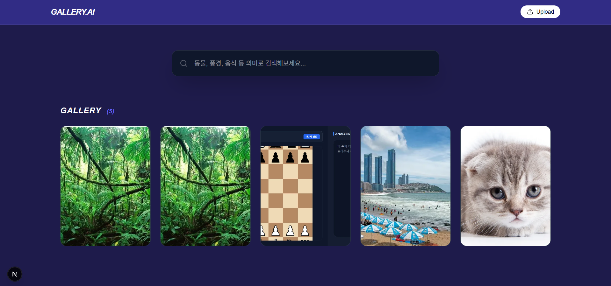

#  AI Semantic Tag Gallery

An intelligent gallery project that automatically generates tags upon image upload and allows users to search images based on **semantic meaning**, moving beyond simple keyword matching.

---

##  Key Features

* **AI Auto-Tagging**: Leverages the **WD14 ViT Tagger** model to automatically extract dozens of relevant tags from uploaded images.
* **Semantic Search**: Utilizes the `paraphrase-multilingual-MiniLM-L12-v2` model to calculate semantic similarity between search queries and tags (e.g., searching "Animal" retrieves "Dog" or "Cat").
* **Modern Architecture**: High-performance full-stack architecture combining **Next.js 14 (App Router)** and **FastAPI**.
* **One-Click Startup**: Provides a unified execution environment via a batch file (`.bat`) for simultaneous frontend and backend startup.

## Tech Stack

### Frontend

* **Framework**: Next.js 14 (App Router)
* **Styling**: Tailwind CSS
* **Icons**: Lucide React

### Backend (AI Server)

* **Framework**: FastAPI
* **AI Models**:
* **WD14 ViT Tagger**: Image Tagging logic
* **Sentence-Transformers**: Semantic Vector Search


* **Inference**: ONNX Runtime

---

##  Getting Started

### Prerequisites

* **Node.js**: 18.17.0 or later
* **Python**: 3.10 or later

### Installation & Execution

1. **Clone the Repository**:
```bash
git clone https://github.com/Podargos37/ai-tag-gallery.git
cd ai-tag-gallery

```


2. **Run the Project**:
* Double-click the `run.bat` file in the root directory to start both servers automatically.
* Access the gallery at `http://localhost:3000` once the startup is complete.


---

##  Project Structure

```text
ai-tag-gallery/
├── server/              # FastAPI AI Server (Tagging & Search logic)
├── src/
│   ├── app/             # Next.js App Router & API Routes
│   └── components/      # UI Components (Gallery, Upload)
├── public/
│   ├── uploads/         # Processed images (.webp)
│   └── metadata/        # Image tags and info (JSON)
└── run.bat              # Unified execution script

```

---

##  How it Works

1. **Image Processing**: Images are optimized and converted to `.webp` format using **Sharp** during upload.
2. **Deep Learning Analysis**: The FastAPI server resizes images to **448x448** and performs inference using the **WD14 model** to predict tags.
3. **Vector Similarity**: When searching, the system calculates the **Cosine Similarity** between the user's query and stored tags, enabling context-aware filtering.

---


#  AI Semantic Tag Gallery

이미지 업로드 시 AI가 자동으로 태그를 생성하고, 단순 키워드 매칭을 넘어 의미 중심(Semantic)으로 이미지를 검색할 수 있는 지능형 갤러리 프로젝트입니다.

---

##  주요 기능

* WD14 ViT Tagger 모델을 사용하여 업로드된 이미지에서 수십 개의 관련 태그를 자동으로 추출합니다. 
* `paraphrase-multilingual-MiniLM-L12-v2` 모델을 활용하여 검색어와 태그 사이의 의미적 유사도를 계산, "동물" 검색 시 "강아지", "고양이" 등을 찾아냅니다. 
* Next.js(App Router)와 FastAPI를 결합한 고성능 아키텍처입니다. 
* 배치 파일(.bat)을 통한 프론트엔드/백엔드 동시 실행 환경을 제공합니다.

##  기술 스택

### Frontend
* **Framework**: Next.js 14 (App Router)
* **Styling**: Tailwind CSS
* **Icons**: Lucide React

### Backend (AI Server)
* **Framework**: FastAPI 
* **AI Models**: 
    * WD14 ViT Tagger (Image Tagging) 
    * Sentence-Transformers (Semantic Vector Search) 
* **Inference**: ONNX Runtime 

---

##  시작하기

### Prerequisites
* Node.js 18+
* Python 3.10+

### Installation & Run
1.  Repository 클론:
    ```bash
    git clone [https://github.com/Podargos37/ai-tag-gallery.git](https://github.com/Podargos37/ai-tag-gallery.git)
    cd ai-tag-gallery
    ```
2.  의존성 설치 및 실행:
    * 루트 폴더에 있는 `run.bat` 파일을 더블 클릭하면 모든 서버가 자동으로 실행됩니다.
    * 브라우저에서 `http://localhost:3000` 접속 확인.

---

##  프로젝트 구조

```text
ai-tag-gallery/
├── server/              # FastAPI AI Server (Tagging & Search logic)
├── src/
│   ├── app/             # Next.js App Router & API Routes
│   └── components/      # UI Components (Gallery, Upload)
├── public/
│   ├── uploads/         # Processed images (.webp)
│   └── metadata/        # Image tags and info (JSON)
└── run.bat      # Unified execution script