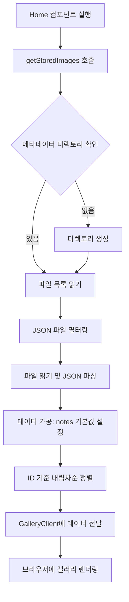
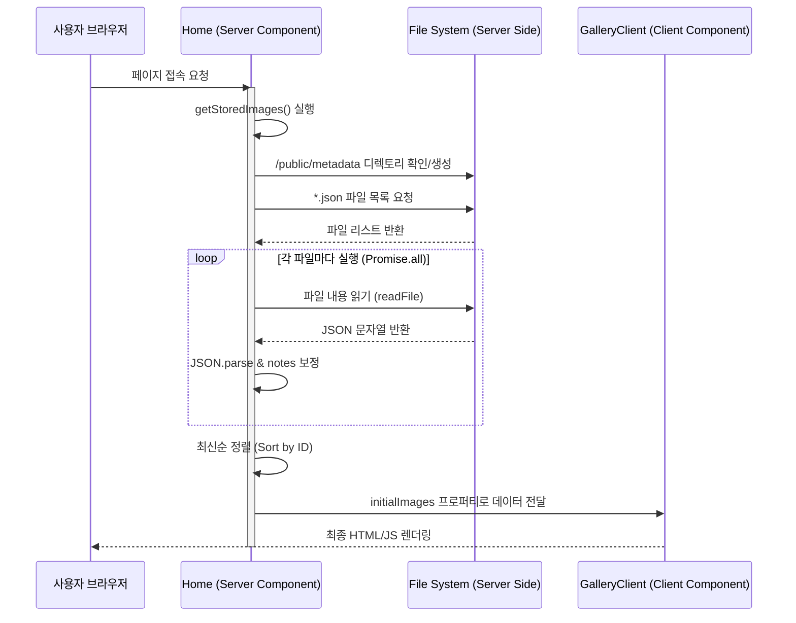

```mermaid
graph TD
    A[Home 컴포넌트 실행] --> B[getStoredImages 호출]
    B -->  C{메타데이터 디렉토리 확인}
    C -- 없음 -->  D[디렉토리 생성]
    C -- 있음 -->  E[파일 목록 읽기]
    D -->  E
    E -->  F[JSON 파일 필터링]
    F -->  G[파일 읽기 및 JSON 파싱]
    G -->  H[데이터 가공: notes 기본값 설정]
    H -->  I[ID 기준 내림차순 정렬]
    I -->  J[GalleryClient에 데이터 전달]
    J -->  K[브라우저에 갤러리 렌더링]
```

```mermaid
sequenceDiagram
    participant Browser as 사용자 브라우저
    participant Home as Home (Server Component)
    participant FS as File System (Server Side)
    participant Gallery as GalleryClient (Client Component)

    Browser->>Home: 페이지 접속 요청
    activate Home
    Home->>Home: getStoredImages() 실행
    Home->>FS: /public/metadata 디렉토리 확인/생성
    Home->>FS: *.json 파일 목록 요청
    FS-->>Home: 파일 리스트 반환
    
    loop 각 파일마다 실행 (Promise.all)
        Home->>FS: 파일 내용 읽기 (readFile)
        FS-->>Home: JSON 문자열 반환
        Home->>Home: JSON.parse & notes 보정
    end

    Home->>Home: 최신순 정렬 (Sort by ID)
    Home->>Gallery: initialImages 프로퍼티로 데이터 전달
    Gallery-->>Browser: 최종 HTML/JS 렌더링
    deactivate Home
```