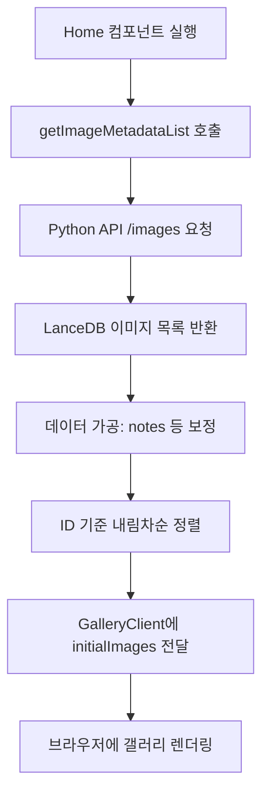
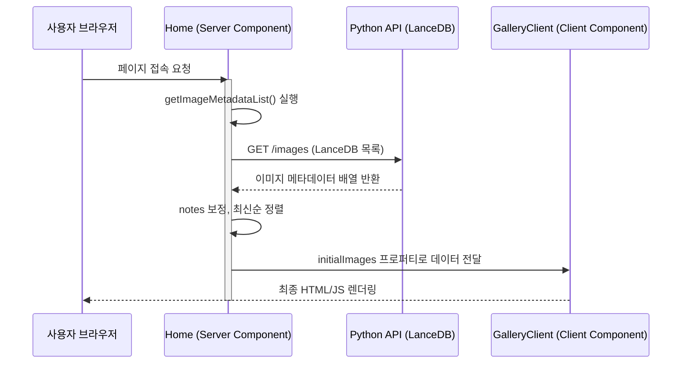

```mermaid
graph TD
    A[Home 컴포넌트 실행] --> B[getImageMetadataList 호출]
    B --> C[Python API /images 요청]
    C --> D[LanceDB 이미지 목록 반환]
    D --> E[데이터 가공: notes 등 보정]
    E --> F[ID 기준 내림차순 정렬]
    F --> G[GalleryClient에 initialImages 전달]
    G --> H[브라우저에 갤러리 렌더링]
```

```mermaid
sequenceDiagram
    participant Browser as 사용자 브라우저
    participant Home as Home (Server Component)
    participant API as Python API (LanceDB)
    participant Gallery as GalleryClient (Client Component)

    Browser->>Home: 페이지 접속 요청
    activate Home
    Home->>Home: getImageMetadataList() 실행
    Home->>API: GET /images (LanceDB 목록)
    API-->>Home: 이미지 메타데이터 배열 반환
    Home->>Home: notes 보정, 최신순 정렬
    Home->>Gallery: initialImages 프로퍼티로 데이터 전달
    Gallery-->>Browser: 최종 HTML/JS 렌더링
    deactivate Home
```
